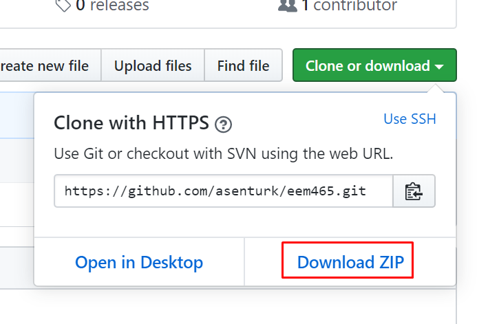

**Ders Notları (26.03.2020)**   

Tüm ders notları eklenmiştir:   
https://github.com/asenturk/eem465/tree/master/Dersler

Ders notlarını indirmekte problem yaşayanlar tüm dosyaları indirerek ders notlarına ulaşabilir:   

---

**Derste kullanılacak cihaz ve program (11.02.2020)**

- Cihaz: [STM32F4 Discovery](https://www.st.com/en/evaluation-tools/stm32f4discovery.html)
- Cihaz için bilgisayarınıza sürücü kurmanız gerekebilir. İndirme sayfası için [tıklayınız](https://www.st.com/content/st_com/en/products/development-tools/software-development-tools/stm32-software-development-tools/stm32-utilities/stsw-link009.html). 
  - 64 bit bilgisayarlar dpinst_amd64.exe dosyasını
  - 32 bit bilgisayarlar dpinst_x86.exe dosyasını kurması gerekiyor.

- Program: [Keil uVision](http://www2.keil.com/mdk5/uvision/)
  - https://www.keil.com/demo/eval/arm.htm adresindeki formu doldurduğunuzda indirme linki çıkacaktır.

---

**Notlandırma (11.02.2020)**    
%40 Ara Sınav       
%60 Final Sınavı

Derste verilecek olan ödevler notlandırmaya tabi olmayacak. Sınavlarda ödevlerden sorular çıkacaktır.

---

**İletişim Bilgileri (03.02.2020)**   

Dr. Öğr. Üyesi Ali ŞENTÜRK   
eposta: alisenturk@isparta.edu.tr   
GitHub: [github.com/asenturk/eem465](#)   
Twitter: [@asntrk](https://twitter.com/asntrk)

---

## Isparta Uygulamalı Bilimler Üniversitesi
### Teknoloji Fakültesi Elektrik Elektronik Mühendisliği
#### EEM-465 Gömülü Sistemler Dersi

